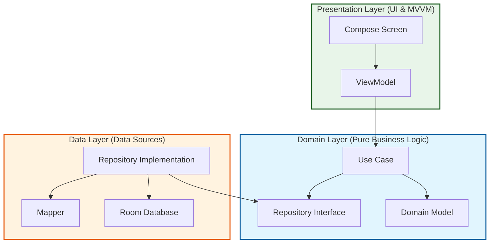
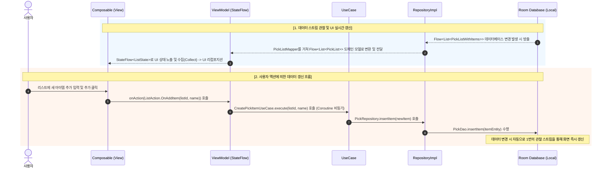
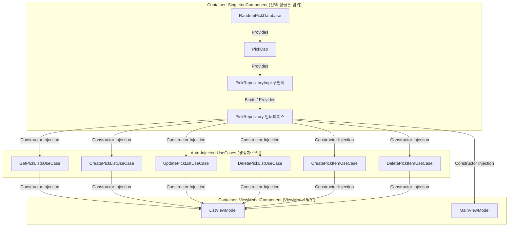

# RandomPick

RandomPick은 일상 속 선택의 고민을 덜어주는 안드로이드 애플리케이션입니다.
간편하게 리스트를 관리하고, 랜덤 뽑기나 사다리 타기 게임을 통해 재미있게 결과를 정할 수 있습니다.

## ✨ 주요 기능

### 1. 리스트 관리 (List Management)
- 나만의 뽑기 리스트를 생성하고 관리할 수 있습니다.
- 각 리스트에 아이템을 자유롭게 추가하거나 삭제할 수 있습니다.
- 최대 아이템 개수 제한을 통해 적절한 게임 환경을 제공합니다.

### 2. 사다리 타기 (Ladder Game)
- 입력한 아이템들을 기반으로 사다리 타기 게임을 즐길 수 있습니다.
- **동적 생성**: 참여자 수에 따라 사다리가 자동으로 생성됩니다.
- **애니메이션**: 사다리를 타는 과정이 애니메이션으로 시각화되어 긴장감을 더합니다.
- **결과 확인**: 게임 종료 후 전체 결과를 한눈에 확인할 수 있습니다.

### 3. 랜덤 뽑기 (Random Pick)
- 리스트에 있는 아이템 중 하나를 무작위로 추첨합니다.
- (추후 업데이트 예정: 다양한 뽑기 모드 지원)

## 🛠 기술 스택 (Tech Stack)

- **Language**: Kotlin
- **UI Framework**: Jetpack Compose
- **Architecture**: MVVM (Model-View-ViewModel)
- **Dependency Injection**: Hilt
- **Asynchronous**: Coroutines & Flow
- **Local Data**: Room Database (Repository Pattern 적용)

## 📱 스크린샷


## 다운로드

<a href="https://play.google.com/store/apps/details?id=com.devhjs.randompick" target="_blank">
  
</a>

---

## 🏗️ 아키텍처 및 폴더 구조 (Architecture & Directory Structure)

본 프로젝트는 **Clean Architecture**와 **MVVM 패턴**을 기반으로 설계되었습니다. 관심사 분리(Separation of Concerns)를 극대화하고, 코드의 테스트 가능성(Testability)과 유지보수성(Maintainability)을 높이기 위해 계층(Layer)을 엄격히 구분하였습니다.

### 1. 계층 구조 및 의존성 방향
의존성은 외부 레이어에서 내부 레이어(Domain)로만 향합니다. 특히 `domain` 레이어는 순수한 Kotlin 코드로 구성되어 안드로이드 프레임워크나 데이터베이스 기술 등의 변화에 전혀 영향을 받지 않습니다.



### 2. 패키지 디렉토리 구조 (Directory Structure)
```text
com.devhjs.randompick
├── RandomPickApp.kt         # Hilt Application 진입점 (Hilt 컨테이너 설정)
├── MainActivity.kt          # 단일 액티비티 구조 (Jetpack Compose 화면 진입점)
│
├── core                     # 전역 공통 모듈 및 유틸리티
│   ├── di                   # Hilt 의존성 주입 정의 (AppModule)
│   ├── navigation           # Compose Navigation (BottomNavBar, NavGraph)
│   ├── ui/theme             # Material3 UI 디자인 테마 정의 (Color, Type, Theme)
│   └── util                 # AdManager 등 공통 광고 및 유틸리티 클래스
│
├── data                     # 데이터 계층 (Data Source, Local Room Database)
│   ├── local
│   │   ├── database         # Room Database 정의 (RandomPickDatabase)
│   │   ├── dao              # Room Data Access Object (PickDao)
│   │   ├── entity           # Room Entity (PickListEntity, PickItemEntity)
│   │   └── relation         # Entity 간 Relationship 정의 (PickListWithItems)
│   ├── mapper               # Data Entity <-> Domain Model 상호 매핑 클래스
│   └── repository           # Domain Repository 구현체 (PickRepositoryImpl)
│
├── domain                   # 도메인 계층 (순수 Kotlin 비즈니스 로직)
│   ├── model                # 핵심 비즈니스 모델 엔티티 (PickList, PickItem)
│   ├── repository           # 데이터 조작을 위한 Repository 인터페이스
│   └── usecase              # 단일 동작 및 비즈니스 정책을 구현한 UseCase 클래스
│
└── presentation             # 프레젠테이션 계층 (Jetpack Compose UI & MVVM)
    ├── componenets          # 화면 간 공유하는 공통 UI 컴포넌트
    ├── main                 # 메인 화면 (추첨, 결과 처리 관련 UI, VM, Action, State)
    ├── list                 # 리스트 관리 화면 (리스트 생성, 삭제, 아이템 편집 UI, VM)
    └── license              # 오픈소스 라이선스 화면
```

---

## 🔄 데이터 흐름 (Data Flow)

본 프로젝트는 **단방향 데이터 흐름(Unidirectional Data Flow, UDF)**과 **리액티브 프로그래밍(Flow & StateFlow)**을 적용하여 예측 가능하고 일관된 상태 제어를 제공합니다.



### 💡 데이터 흐름 상세 설명
- **관찰(Observation) 기반 갱신**: 데이터베이스가 변경될 때마다 Room이 제공하는 Kotlin `Flow`를 타고 데이터가 자동으로 흘러나옵니다. View가 ViewModel의 `StateFlow`를 지속적으로 관찰(Collect)하고 있기 때문에, 사용자가 별도의 새로고침 버튼을 누르지 않아도 UI가 최신 데이터로 알아서 업데이트됩니다.
- **예측 가능한 단방향 제어(UDF)**: View는 오직 `ListAction` 또는 `MainAction`과 같은 단일 진입 경로(ViewModel의 `onAction`)로만 이벤트를 전달합니다. 비즈니스 로직(UseCase)을 통과한 데이터가 DB에 영속화되면 관찰 스트림을 통해 상태가 변경되므로, 상태 불일치(State Inconsistency) 현상이 근본적으로 방지됩니다.

---

## 💉 의존성 주입 (Dependency Injection with Hilt)

객체 간 결합도를 줄이고 단일 책임 원칙을 유지하며 테스트 코드 작성을 용이하게 하기 위해 **Dagger Hilt**를 사용하여 의존성 주입을 처리하고 있습니다.



### 📌 DI 구조의 설계 특징
1. **Repository 인터페이스 분리 (DIP 적용)**
   - `domain` 레이어에는 인터페이스인 `PickRepository`를 두고, `data` 레이어에 `PickRepositoryImpl` 구현체를 배치하였습니다.
   - Hilt 모듈(`AppModule`)을 통해 구현체를 인터페이스 타입으로 제공함으로써, 상위 레이어가 하위 레이어의 실질적인 구현(Room DB 사용 여부 등)에 의존하지 않도록 의존 역전 원칙(DIP)을 엄격히 준수하였습니다.
2. **Hilt Component Lifecycle**
   - `@InstallIn(SingletonComponent::class)`를 사용하는 `AppModule`은 데이터베이스 및 데이터 소스 컴포넌트를 **싱글톤**으로 생명주기 관리하여 중복 인스턴스 생성을 방지하고 자원을 효율적으로 보존합니다.
   - ViewModel은 `@HiltViewModel`을 사용해 안드로이드 시스템의 ViewModel 생명주기와 완벽하게 싱글톤 매핑되어 의존성을 안전하게 제공받습니다.
```
